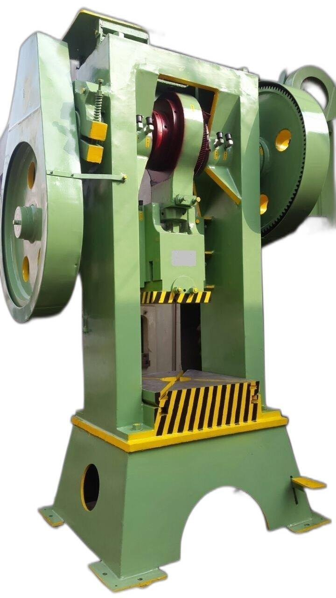
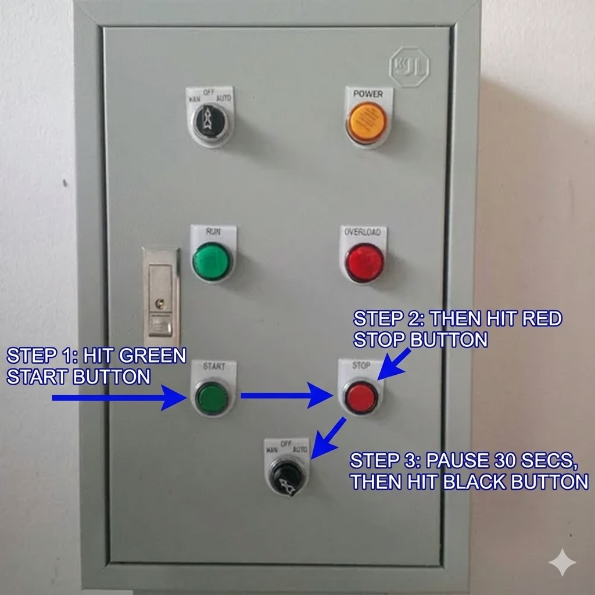

# WI-009: Cold Forging Operations

**Document ID**: WI-009
**Effective Date**: 2024-11-26
**Last Revised**: 2024-11-26
**Author**: Manufacturing Engineering
**Approval**: Production Manager

---

## Purpose & Scope

This work instruction provides detailed procedures for performing cold forging operations on manufacturing equipment. Cold forging is a precision process requiring careful setup, proper material handling, and adherence to detailed specifications.

**Equipment Covered**:

- Cold Forging Presses (hydraulic and mechanical)
- Multi-Station Cold Forging Machines
- Progressive Cold Forging Systems

**Personnel**: Certified cold forging operators and forging supervisors

**Materials Covered**:

- Steel (low-carbon, medium-carbon)
- Aluminum alloys
- Copper and brass
- Other specified materials suitable for cold forging

*Cold forging press with mechanical drive system and safety features*

---

## Before You Start

### Required Training & Certification

- [ ] Cold Forging Operator Certification
- [ ] Material-Specific Training (steel, aluminum, copper)
- [ ] Completed Equipment-Specific Training
- [ ] Current Safety Certification
- [ ] LOTO Authorization (if applicable)

### Required Materials & Tools

**Consumables**:
- Raw material blanks (correct type, size, and specification)
- Die lubricant (appropriate for material and process)
- Cleaning solvents (as specified)

**Tooling & Equipment**:
- Forging dies (upper and lower, matched set)
- Die installation tools
- Material handling equipment (tongs, lifters)
- Precision measurement tools (calipers, micrometers, gauges)
- Die maintenance tools
- Safety equipment (safety glasses, hearing protection, gloves)

---

## Step 1: Pre-Operation Setup Inspection

### Forging Machine Preparation

1. Verify work area is clean:
   - [ ] No oil, grease, or contaminants on machine
   - [ ] No loose metal pieces or debris
   - [ ] Machine surface clean and stable
   - [ ] Work area clear of obstacles
   - [ ] Floor area clean and dry

2. Inspect equipment condition:
   - [ ] Machine powers on properly
   - [ ] All gauges readable and calibrated
   - [ ] Hydraulic system operational (check fluid level)
   - [ ] Electrical connections secure and undamaged
   - [ ] Safety guards in place and functional
   - [ ] Emergency stop button functional

3. Check hydraulic system (if applicable):
   - [ ] Hydraulic fluid level adequate
   - [ ] Pressure gauge reading normal
   - [ ] No visible leaks in hydraulic lines
   - [ ] System pressure within specification
   - [ ] Test cycle operation (no load)

4. Verify mechanical systems:
   - [ ] Ram movement smooth and controlled
   - [ ] Die holder secure and aligned
   - [ ] Ejection system operational
   - [ ] Feed mechanism functional (if automatic)
   - [ ] All safety interlocks operational

5. Safety systems check:
   - [ ] Safety guards properly positioned
   - [ ] Light curtains operational (if equipped)
   - [ ] Emergency stop accessible and functional
   - [ ] Fire extinguisher accessible
   - [ ] First aid kit accessible

---

## Step 2: Material & Workpiece Preparation

### Material Selection & Verification

1. Verify material type matches work order:
   - Check material specification on work order
   - Verify material received matches specification
   - Check material certification/test report if required
   - For critical parts, verify material traceability
   - Verify material lot number matches work order

2. Material preparation:
   - Inspect raw material blanks:
     - [ ] Correct diameter/size per specification
     - [ ] No surface defects (cracks, deep scratches)
     - [ ] Material clean and free of contaminants
     - [ ] Material within dimensional tolerance
   - Clean material if necessary:
     - Remove oil or grease with solvent
     - Remove surface oxidation if required
     - Allow material to dry completely
     - Handle with clean gloves to prevent contamination

3. Material conditioning (if required):
   - Check work order for annealing requirements
   - Verify material hardness within specification
   - If material too hard, may require annealing
   - Document material condition before forging

### Special Material Preparation

**For Low-Carbon Steel**:
1. Standard cleaning usually sufficient
2. Verify material is soft enough for cold forging
3. Check for surface scale that may affect die life

**For Aluminum**:
1. Material should be clean and dry
2. Verify alloy type matches specification
3. Check for surface oxidation (may need cleaning)
4. Handle carefully to avoid surface damage

**For Copper/Brass**:
1. Clean surface to remove oxidation
2. Verify material is in annealed condition
3. Check for surface defects that could cause issues

### Material Lubrication

1. Apply die lubricant to material blanks:
   - Use specified lubricant for material type
   - Apply evenly to all surfaces that contact dies
   - Allow lubricant to set per manufacturer instructions
   - Do not over-lubricate (excess can cause defects)

2. Lubricant selection:
   - Steel: typically phosphate coating or oil-based
   - Aluminum: specialized aluminum forging lubricant
   - Copper/Brass: appropriate non-reactive lubricant
   - Follow work order specification exactly

---

## Step 3: Die Setup & Installation

### Die Inspection

1. **Die condition check**:
   - [ ] Dies match work order specification
   - [ ] Upper and lower dies are matched set
   - [ ] Die surfaces clean and free of damage
   - [ ] No cracks or excessive wear visible
   - [ ] Die dimensions verified with gauges
   - [ ] Die identification numbers match work order

2. **Die cleaning**:
   - Remove any residual material from previous run
   - Clean die surfaces with appropriate solvent
   - Inspect for embedded material or damage
   - Apply protective coating if storing after use

### Die Installation

1. **Power down and secure machine**:
   - [ ] Machine powered off
   - [ ] LOTO applied (if required)
   - [ ] Ram in fully retracted position
   - [ ] Safety guards open/removed for access

2. **Remove existing dies** (if present):
   - Carefully remove upper die from holder
   - Remove lower die from bed
   - Clean die mounting surfaces
   - Inspect mounting surfaces for damage

3. **Install lower die**:
   - Position lower die in die bed
   - Align die with mounting features
   - Secure die with mounting bolts
   - Torque bolts to specification
   - Verify die is level and properly seated

4. **Install upper die**:
   - Position upper die in ram holder
   - Align with lower die (use alignment pins if provided)
   - Secure with mounting bolts
   - Torque bolts to specification
   - Verify alignment with lower die

5. **Die alignment verification**:
   - [ ] Upper and lower dies aligned correctly
   - [ ] No visible misalignment
   - [ ] Dies make contact evenly (test with paper or feeler gauge)
   - [ ] Clearance correct for material thickness
   - [ ] Ejection system aligned (if applicable)

---

## Step 4: Machine Parameter Setup

*Control panel operation sequence: Start → Stop → Pause 30 seconds → Activate*

### Equipment Parameter Selection

Based on material type, size, and part configuration:

**Low-Carbon Steel (1/2" - 1" diameter)**:
- Tonnage: 50-200 tons (depending on reduction)
- Stroke speed: 10-30 strokes/minute
- Dwell time: 0.5-2 seconds (if applicable)
- Ejection force: 5-10% of forging force

**Aluminum (1/2" - 1" diameter)**:
- Tonnage: 30-150 tons (depending on reduction)
- Stroke speed: 15-40 strokes/minute
- Dwell time: 0.3-1.5 seconds
- Ejection force: 3-8% of forging force

**Copper/Brass (1/2" - 1" diameter)**:
- Tonnage: 40-180 tons (depending on reduction)
- Stroke speed: 12-35 strokes/minute
- Dwell time: 0.4-1.8 seconds
- Ejection force: 4-9% of forging force

### Parameter Entry

1. Set tonnage/pressure:
   - Adjust pressure control to specified setting
   - Verify reading on pressure gauge
   - Prepare to test and adjust if needed

2. Set stroke speed:
   - Adjust speed control to specification
   - Verify setting on control panel
   - Test cycle to verify speed

3. Set dwell time (if applicable):
   - Program dwell time per specification
   - Verify setting on control display

4. Set ejection parameters:
   - Configure ejection force
   - Set ejection timing
   - Verify ejection system ready

5. Power equipment on:
   - Verify all systems ready
   - Listen for normal operation sounds
   - Verify LED indicators light
   - Test emergency stop function

---

## Step 5: Forging Process - Trial Run

### Test Forging on Sample Material

1. **Setup test forging**:
   - Use sample material of same type and size
   - Prepare 3-5 test blanks
   - Position first blank in lower die
   - Verify blank centered and properly seated

2. **First forging cycle**:
   - Activate machine cycle (manual or automatic)
   - Observe ram descent:
     - Should be smooth and controlled
     - No unusual sounds or vibrations
   - Watch material deformation:
     - Material should flow smoothly
     - No excessive force required
     - Dies should fill completely

3. **Observe forging process**:
   - Material should fill die cavity completely
   - No flash or excess material (or minimal per spec)
   - Part should eject cleanly
   - No sticking in dies
   - Verify tonnage within expected range

4. **Inspect test part**:
   - Remove part from machine
   - Allow to cool if warm
   - Measure critical dimensions:
     - [ ] Length/height within tolerance
     - [ ] Diameter/width within tolerance
     - [ ] Surface finish acceptable
   - Check for defects:
     - [ ] No cracks or splits
     - [ ] No surface defects
     - [ ] Proper fill of all die features
     - [ ] No excessive flash

5. **Adjust if necessary**:
   - If dimensions incorrect, adjust tonnage or stroke
   - If defects present, check material, lubrication, or dies
   - If sticking occurs, check lubrication or ejection
   - Re-test until acceptable results achieved

---

## Step 6: Production Forging

### Production Forging Execution

1. **Position prepared material blanks**:
   - Ensure blanks are clean and lubricated
   - Verify blank size matches specification
   - Position first blank in lower die
   - Verify blank centered and properly seated

2. **Start the forging cycle**:
   - Activate machine cycle
   - Monitor ram descent and material deformation
   - Verify tonnage within expected range
   - Watch for any unusual behavior

3. **Complete forging cycle**:
   - Allow cycle to complete fully
   - Verify part ejects properly
   - Remove finished part from machine
   - Place part in designated container

4. **Continuous operation**:
   - Load next blank immediately after part removal
   - Maintain consistent cycle time
   - Monitor part quality periodically
   - Check for any changes in machine behavior

5. **Quality monitoring**:
   - Inspect parts every 10-20 cycles (or per specification)
   - Measure critical dimensions
   - Check for defects or wear indicators
   - Document any issues or adjustments

### Multi-Station Forging (if applicable)

For progressive or multi-station machines:

1. **Station 1 (initial forming)**:
   - First reduction or pre-form
   - Verify material flows correctly
   - Check for proper material distribution

2. **Intermediate stations**:
   - Progressive forming operations
   - Monitor material flow at each station
   - Verify part transfers correctly between stations

3. **Final station**:
   - Final shape and dimensions
   - Verify complete die fill
   - Check final part quality

---

## Step 7: Part Quality Inspection

### Immediate Post-Forging Inspection

1. **Visual inspection**:
   - Check part appearance:
     - [ ] Smooth surface finish
     - [ ] Complete die fill (all features present)
     - [ ] No visible cracks or defects
     - [ ] Flash within specification (if applicable)
   - Check for defects:
     - [ ] No surface cracks or splits
     - [ ] No excessive flash
     - [ ] No underfill or incomplete forming
     - [ ] No material flow lines indicating problems

2. **Dimensional inspection**:
   - Allow part to cool to room temperature
   - Measure critical dimensions:
     - [ ] Length/height (within tolerance)
     - [ ] Diameter/width (within tolerance)
     - [ ] Wall thickness (if applicable)
     - [ ] Feature locations (within tolerance)
   - Use appropriate measuring tools:
     - Calipers for general dimensions
     - Micrometers for precision dimensions
     - Gauges for specific features
   - Compare to requirements on work order

3. **Functional assessment**:
   - If hardness test required, note for testing
   - If surface finish test required, prepare sample
   - If dimensional inspection required, mark for CMM
   - If material testing required, prepare sample

### Post-Forging Testing (if required)

1. **Hardness Test** (if specified):
   - Prepare sample from forged part
   - Test hardness per specification
   - Compare to requirements
   - Document results

2. **Dimensional Inspection** (CMM or manual):
   - Full dimensional inspection per drawing
   - Verify all features within tolerance
   - Document results on inspection report

3. **Surface Finish Test** (if required):
   - Measure surface roughness
   - Compare to specification
   - Document results

4. **Material Testing** (if required):
   - Prepare sample for material testing
   - Test per specification (tensile, etc.)
   - Document results

---

## Step 8: Part Cleanup & Finishing

### Immediate Cleanup

1. Remove excess lubricant:
   - Wipe parts clean with appropriate solvent
   - Remove all forging lubricant residue
   - Parts should be clean and ready for next operation

2. Remove flash (if applicable):
   - Trim flash per specification
   - Use appropriate trimming method
   - Be careful not to damage part
   - Verify flash removal complete

3. Clean part surface:
   - Remove any remaining debris
   - Wipe clean with cloth
   - Part should be clean and ready

### Heat Treatment (if required)

1. Check work order for post-forging heat treatment:
   - Stress relief required?
   - Annealing required?
   - Hardening/tempering required?
   - Material-specific requirements?

2. If heat treatment required:
   - Mark part clearly
   - Coordinate with heat treat department
   - Allow to cool first before moving
   - Document heat treat parameters

### Final Inspection & Documentation

1. Final visual check:
   - One last examination before shipment
   - Verify no missed defects
   - Verify part meets specification
   - Verify appearance acceptable

2. Document completion:
   - Record on work order:
     - Forging completed by (operator name)
     - Machine parameters used
     - Inspection results
     - Pass/fail status
     - Quantity produced
   - Sign and date documentation
   - File in work order

---

## Step 9: Equipment Shutdown & Cleanup

### Post-Operation Equipment Care

1. **Power down equipment**:
   - Complete current cycle if in progress
   - Retract ram to fully up position
   - Turn off machine power
   - Allow machine to cool 5-10 minutes

2. **Remove dies** (if changing for next job):
   - Carefully remove upper die
   - Remove lower die
   - Clean dies thoroughly
   - Inspect dies for wear or damage
   - Apply protective coating
   - Store dies in designated location

3. **Clean work area**:
   - Remove all finished parts
   - Remove any material blanks
   - Clean machine surfaces:
     - Remove lubricant residue
     - Remove any metal particles
     - Wipe down all surfaces
   - Sweep floor area
   - Dispose of waste properly

4. **Machine maintenance**:
   - Check hydraulic fluid level (if applicable)
   - Inspect for any leaks
   - Note any issues for maintenance
   - Complete maintenance log if required

5. **Work area preparation for next shift**:
   - Clear all tooling and fixtures
   - Store tooling appropriately
   - Leave machine clean and organized
   - Verify no safety hazards
   - Leave machine in safe condition

---

## Safety Reminders

- **High pressure**: Cold forging uses extremely high forces—never place hands in die area during operation
- **Pinch points**: Keep hands clear of moving parts, especially ram and die areas
- **Material handling**: Use proper lifting techniques—forged parts may be heavy
- **Lubricants**: Some forging lubricants may be hazardous—follow MSDS guidelines
- **Noise**: Forging operations can be loud—always wear hearing protection
- **PPE**: Always wear safety glasses, hearing protection, and appropriate gloves
- **Machine guards**: Never operate machine with guards removed or bypassed
- **Emergency stop**: Know location of emergency stop and use immediately if unsafe condition occurs

---

## Troubleshooting

### Problem: Part Sticking in Dies
- [ ] Verify adequate lubrication applied
- [ ] Check ejection system operational
- [ ] Verify ejection force sufficient
- [ ] Check for die wear or damage
- [ ] Verify material within specification

### Problem: Incomplete Die Fill
- [ ] Verify tonnage/pressure adequate
- [ ] Check material size correct
- [ ] Verify material soft enough for cold forging
- [ ] Check for excessive lubrication (can prevent fill)
- [ ] Verify dies clean and free of debris

### Problem: Excessive Flash
- [ ] Verify material size not too large
- [ ] Check die alignment and closure
- [ ] Verify tonnage not excessive
- [ ] Check for die wear allowing excess material flow

### Problem: Cracks or Splits in Part
- [ ] Verify material within specification (not too hard)
- [ ] Check for material defects before forging
- [ ] Verify reduction ratio not too high
- [ ] Check lubrication adequate
- [ ] Verify material properly annealed if required

### Problem: Dimensional Out of Tolerance
- [ ] Verify dies correct for part specification
- [ ] Check for die wear affecting dimensions
- [ ] Verify material size correct
- [ ] Check tonnage/pressure settings
- [ ] Verify part cooled before measurement

### Problem: Surface Defects
- [ ] Verify material surface clean before forging
- [ ] Check for die surface damage
- [ ] Verify lubrication adequate and correct type
- [ ] Check for embedded material in dies
- [ ] Verify material within specification

---

## Document History

| Version | Date | Changes | Author |
|---------|------|---------|--------|
| 1.0 | 2024-11-26 | Initial release | Manufacturing Engineering |

---

**Questions or Suggestions?** Contact Manufacturing Engineering Department

