# Equipment Maintenance and Management

## Maintenance Philosophy

Equipment is critical to our operational success. Preventive maintenance reduces unexpected downtime, extends equipment life, and ensures product quality. All equipment maintenance follows established procedures and documentation requirements.

## Maintenance Strategy

*Preventive maintenance on industrial equipment*

### Maintenance Types

**Preventive Maintenance (PM)**:
- Scheduled maintenance at regular intervals
- Oil changes, filter replacements, lubrication
- Wear component replacement before failure
- Reduces unplanned downtime by 75%

**Predictive Maintenance (PdM)**:
- Condition-based maintenance monitoring
- Vibration analysis for rotating equipment
- Thermal imaging for electrical components
- Ultrasound for leak detection
- Allows detection of impending failures

**Corrective Maintenance**:
- Repair of equipment failures
- Emergency response for critical breakdowns
- Root cause analysis to prevent recurrence
- Planned corrective actions for minor issues

## Equipment Master List

Maintained in computerized Maintenance Management System (MMS):

| Field | Description |
|-------|-------------|
| Equipment ID | Unique identifier (e.g., MIL-001) |
| Description | Make, model, serial number |
| Location | Production area and specific location |
| Criticality | Critical/Important/Standard classification |
| Acquisition Date | Date equipment installed/purchased |
| Original Cost | For depreciation and replacement planning |
| Maintenance History | Complete log of all service |
| Spare Parts List | Critical parts and suppliers |
| Technical Manuals | Storage location or digital access |
| Operator Manual | Location and version |
| Safety Information | Hazards, guards, certifications |

## Preventive Maintenance Program

### PM Schedule Timeline

### PM Schedule

All equipment subject to preventive maintenance based on:
- Manufacturer recommendations
- Historical failure patterns
- Operational hours or cycles
- Environmental conditions
- Production volume

### Maintenance Intervals

**Daily**:
- Visual inspection for unusual conditions
- Noise and vibration assessment
- Lubricant level checks
- Cleaning and chip removal

**Weekly**:
- Detailed inspection of critical components
- Lubrication of specified points
- Guard and safety feature verification
- Temperature monitoring

**Monthly**:
- Filter inspection and replacement (if needed)
- Fluid analysis for hydraulic/cooling systems
- Precision calibration checks
- Electrical connection inspection

**Quarterly**:
- Major lubrication cycle
- Bearing inspection and adjustment
- Coupling alignment verification
- Performance baseline testing

**Semi-Annual**:
- Deep system cleaning
- Seal replacement (scheduled items)
- Hydraulic fluid analysis and change
- Complete calibration verification

**Annual**:
- Major overhaul of critical components
- Manufacturer-recommended service
- Paint and rust prevention
- Electrical system comprehensive test

### PM Work Orders

Generated automatically 2 weeks before PM due date:
- Includes equipment history and specifications
- Lists all tasks to be performed
- Specifies parts and materials needed
- Identifies required tools and safety precautions
- Includes estimated duration and craft skills needed

## Maintenance Execution

*Skilled maintenance technician performing equipment service*

### Maintenance Personnel

**Skill Levels**:
- **Level 1 (Operator Maintenance)**: Daily checks, basic cleaning, minor adjustments
- **Level 2 (Production Maintenance)**: PM execution, minor repairs, parts replacement
- **Level 3 (Maintenance Technician)**: Complex diagnostics, major repairs, equipment commissioning
- **Level 4 (Specialist)**: Vendor-specific equipment, engineering support, training

### Work Order Process

```mermaid
graph TD
    A["📋 WO Generated<br/>by MMS"] --> B["👤 Assign to<br/>Technician"]
    B --> C["📦 Gather Parts &<br/>Materials"]
    C --> D["📅 Schedule with<br/>Production"]
    D --> E["🔒 LOTO &<br/>Safety Setup"]
    E --> F["🔧 Perform<br/>Maintenance"]
    F --> G["✓ Verify<br/>Work Quality"]
    G --> H{Work<br/>Acceptable?}
    H -->|No| I["🔄 Rework or<br/>Fix Issues"]
    I --> G
    H -->|Yes| J["📝 Log Work<br/>Details"]
    J --> K["👁️ Supervisor<br/>Review"]
    K --> L["✅ Clear for<br/>Production"]
    L --> M["📊 Update<br/>Equipment History"]

    style A fill:#e3f2fd
    style L fill:#c8e6c9
    style H fill:#fff3cd
    style E fill:#ffebee
```

**Steps:**

1. **Generation**: MMS creates PM work order automatically
2. **Preparation**: Technician reviews work order and gathers materials
3. **Scheduling**: Coordinated with Production to minimize downtime
4. **Execution**: Work performed following documented procedures
5. **Documentation**: All work logged with times and parts used
6. **Verification**: Supervisor verifies work completion
7. **Sign-Off**: Equipment cleared for production use

### Safety During Maintenance

- LOTO procedures always followed when required
- Confined space entry protocols if applicable
- Hot work permits for welding/cutting
- Fall protection for elevated work
- Temporary guards installed during maintenance
- Warning signs and barriers in place

## Predictive Maintenance Program

*Thermal imaging for predictive maintenance diagnostics*

### Condition Monitoring

**Vibration Analysis**:
- Monthly measurements on rotating equipment
- Baseline established during commissioning
- Trending to identify developing problems
- Failure patterns documented for early warning

**Thermal Imaging**:
- Quarterly surveys of electrical and mechanical systems
- Temperature anomalies investigated
- Bearing overheating detected early
- Motor winding problems identified

**Oil Analysis**:
- Samples taken from hydraulic and gear systems quarterly
- Tests include viscosity, contamination, wear metals
- Trends indicate component wear progression
- Chemical breakdown detected

**Ultrasonic Inspection**:
- Monthly monitoring of bearing lubrication
- Cavitation detection in pumps
- Electrical discharge mapping
- Leak detection in sealed systems

### Data Management

- All readings entered into MMS
- Trends analyzed monthly
- Alerts generated when thresholds exceeded
- Root cause analysis for abnormal conditions
- Maintenance recommendations generated automatically

## Spare Parts Management

### Critical Spare Parts Inventory

Maintained for equipment with:
- Long lead times (>2 weeks)
- Single sources
- High failure frequency
- Critical to production

Typical critical parts:
- Bearing sets and seals
- Hydraulic pumps and motors
- Electrical motors and contactors
- Drive belts and chains
- Cutting tool holders

### Spare Parts System

- Inventory tracked in MMS
- Automatic reorder when stock reaches minimum
- Supplier lead times documented
- Storage locations and condition controlled
- Quarterly inventory counts

### Parts Documentation

- Engineering drawings for reproduction parts
- Cross-reference numbers for interchangeable items
- Supplier information and pricing
- Installation instructions for complex assemblies
- Obsolescence monitoring for older equipment

## Emergency Maintenance Response

### Unplanned Equipment Failure

Response procedure:
1. **Stop Production**: Safely power down equipment (LOTO if necessary)
2. **Notify Maintenance**: Immediately contact maintenance supervisor
3. **Assess Damage**: Preliminary assessment of failure extent
4. **Documentation**: Photo documentation of failure
5. **Root Cause**: Begin diagnosis of failure cause
6. **Estimate**: Time and cost estimate for repair
7. **Notification**: Inform Production of expected downtime
8. **Repair**: Execute corrective maintenance as quickly as possible

### Critical Equipment Failure

For failures affecting production more than 4 hours:
- Contact equipment vendor for support
- Evaluate temporary alternative solutions
- Prepare capital request for replacement if repair uneconomical
- Document all costs
- Conduct failure analysis meeting

## Equipment Upgrades and Replacement

### Capital Equipment Assessment

Annual review considers:
- Equipment age and reliability
- Maintenance costs vs. replacement cost
- Obsolescence of parts and service
- Capability improvements available
- Energy efficiency gains
- Environmental compliance requirements

### Replacement Decision Criteria

Replace equipment when:
- Maintenance exceeds 40% of replacement cost annually
- Equipment reliability <95% uptime
- Parts no longer available
- Technology has advanced significantly
- Environmental regulations require upgrade

### Decommissioning

When equipment retired:
- Remove from service safely
- Drain all fluids properly
- Decontaminate if hazardous materials present
- Salvage valuable components and materials
- Document final disposition
- Remove from asset register

## Maintenance Efficiency Metrics

### Key Performance Indicators

| Metric | Target | Frequency |
|--------|--------|-----------|
| Equipment Uptime | 95%+ | Weekly |
| Mean Time Between Failures (MTBF) | ↑ 15% annually | Monthly |
| Mean Time To Repair (MTTR) | ↓ 10% annually | Monthly |
| Preventive/Corrective Maintenance Ratio | 70%/30% | Monthly |
| Maintenance Cost per Unit Produced | ↓ Target | Monthly |
| Schedule Compliance | 95% | Weekly |

### Performance Dashboards

Monthly reports include:
- Equipment downtime by machine
- Maintenance cost trends
- PM schedule compliance
- Emergency maintenance incidents
- Spare parts utilization
- Technician productivity

## Vendor Service Contracts

### Service Agreements

For complex equipment:
- **Type 1**: Preventive maintenance only
- **Type 2**: PM + emergency response within 4 hours
- **Type 3**: Full-service including parts and labor
- **Type 4**: Managed equipment with vendor ownership

### Vendor Certification

Authorized service providers must:
- Be factory-trained and certified
- Carry required liability insurance
- Maintain proper tools and test equipment
- Follow our safety and quality procedures
- Provide service documentation
- Respond within agreed timeframes

## Maintenance Documentation

### Record Keeping

All maintenance documented in MMS:
- Work performed and by whom
- Parts and materials used
- Time spent (labor hours)
- Equipment condition before and after
- Problems encountered and solutions
- Next maintenance date

### Technical Manuals and Drawings

Maintained for all equipment:
- Digital copies backed up securely
- Printed copies in equipment area
- Updated versions when revisions issued
- Accessibility during maintenance
- Version control implemented

### Continuous Improvement

- Maintenance technicians track lessons learned
- Procedure improvements documented
- Best practices shared in team meetings
- Training updated based on maintenance experience
- Equipment design feedback to engineering

## Glossary

- **MTBF**: Mean Time Between Failures
- **MTTR**: Mean Time To Repair
- **PM**: Preventive Maintenance
- **PdM**: Predictive Maintenance
- **MMS**: Maintenance Management System
- **LOTO**: Lock-Out/Tag-Out procedures
