# Production Processes

## Overview

This document outlines the standard manufacturing processes used in our facility. All production staff must follow these procedures to ensure product quality, worker safety, and operational efficiency.

## Production Flow

*Modern manufacturing facility with organized production areas*

### Overall Production Process

```mermaid
graph TD
    A["📦 Raw Material<br/>Receiving"] --> B["🔍 Material<br/>Inspection"]
    B --> C{Material<br/>Acceptable?}
    C -->|Yes| D["📍 Store in<br/>Inventory"]
    C -->|No| E["❌ Reject &<br/>Return"]
    D --> F["⚙️ Equipment<br/>Setup"]
    F --> G["✅ Setup<br/>Verification"]
    G --> H["🏭 Production<br/>Run"]
    H --> I["📊 Monitor &<br/>Record Data"]
    I --> J["🔍 In-Process<br/>Inspection"]
    J --> K{Quality<br/>OK?}
    K -->|Yes| L["📦 Continue<br/>Production"]
    K -->|No| M["⚠️ Stop & Adjust<br/>Process"]
    M --> H
    L --> N["✔️ Final<br/>Inspection"]
    N --> O{Pass Final<br/>Check?}
    O -->|Yes| P["📦 Package &<br/>Label"]
    O -->|No| Q["♻️ Rework or<br/>Scrap"]
    P --> R["✅ Ready for<br/>Shipment"]
    style A fill:#e1f5ff
    style R fill:#c8e6c9
    style E fill:#ffcdd2
    style Q fill:#ffcdd2
```

### 1. Raw Material Preparation

- **Material Inspection**: All incoming raw materials must be inspected against specifications
- **Storage**: Materials stored in designated areas maintaining proper temperature and humidity
- **Handling**: Use appropriate equipment (forklifts, pallet jacks) for material movement
- **Documentation**: Log all material batches in the inventory management system

*Proper material handling and storage procedures*

### 2. Setup Phase

- Verify all equipment is operational and calibrated
- Install proper tooling and fixtures
- Perform setup test runs with quality verification
- Document setup completion and approval by shift supervisor

### 3. Production Run

*Precision CNC machinery in operation*

- Follow equipment-specific operating procedures
- Monitor production metrics continuously
- Record production data at defined intervals
- Maintain cleanliness and organization of work area

### 4. Quality Checkpoints

Quality checks occur at these intervals:
- **First Article Inspection (FAI)**: Before full production run
- **In-Process Checks**: Every 2 hours or per batch specifications
- **Final Inspection**: 100% of units before packaging

### 5. Documentation

All production runs require:
- Production log with timestamps
- Operator initials and badge numbers
- Equipment settings and adjustments
- Any downtime or quality issues logged
- Final count and disposition of produced units

## Equipment Operation Standards

### Pre-Operation Checklist

- [ ] Equipment safety guards in place
- [ ] All emergency stops functional
- [ ] Coolant/lubrication levels adequate
- [ ] No visible damage or unusual wear
- [ ] Compressed air lines secured
- [ ] Electrical connections secure

### During Operation

- Keep work area clear of obstructions
- Wear required PPE at all times
- Never operate equipment with guards removed
- Report unusual sounds or vibrations immediately
- Follow lockout/tagout procedures for maintenance

### Post-Operation

- Power down equipment properly
- Clean and organize work station
- Remove materials from equipment
- Report any maintenance needs to supervisor

## Shift Handover Protocol

At the end of each shift:
1. Complete production log entries
2. Report any incomplete work to next shift
3. Describe any equipment issues or concerns
4. Hand over work orders to next operator
5. Sign off on shift completion

## Process Improvement

Operators should report:
- Bottlenecks in production flow
- Quality issues or near-misses
- Equipment performance concerns
- Potential efficiency improvements
- Safety hazards

Improvement suggestions are reviewed in weekly production meetings.

## Compliance and Audits

All production processes are subject to:
- Internal audits (quarterly)
- Customer audits
- Regulatory compliance inspections
- Certification body audits (as applicable)

Maintain full documentation for a minimum of 7 years for finished goods traceability.
