# Production Processes

## Overview

This document outlines the standard manufacturing processes used in our facility. All production staff must follow these procedures to ensure product quality, worker safety, and operational efficiency.

## Production Flow

*Modern manufacturing facility with organized production areas*

### Overall Production Process

```mermaid
graph TD
    A["📦 Raw Material<br/>Receiving"] --> B["🔍 Material<br/>Inspection"]
    B --> C{Material<br/>Acceptable?}
    C -->|Yes| D["📍 Store in<br/>Inventory"]
    C -->|No| E["❌ Reject &<br/>Return"]
    D --> F["⚙️ Equipment<br/>Setup"]
    F --> G["✅ Setup<br/>Verification"]
    G --> H["🏭 Production<br/>Run"]
    H --> I["📊 Monitor &<br/>Record Data"]
    I --> J["🔍 In-Process<br/>Inspection"]
    J --> K{Quality<br/>OK?}
    K -->|Yes| L["📦 Continue<br/>Production"]
    K -->|No| M["⚠️ Stop & Adjust<br/>Process"]
    M --> H
    L --> N["✔️ Final<br/>Inspection"]
    N --> O{Pass Final<br/>Check?}
    O -->|Yes| P["📦 Package &<br/>Label"]
    O -->|No| Q["♻️ Rework or<br/>Scrap"]
    P --> R["✅ Ready for<br/>Shipment"]
    style A fill:#e1f5ff
    style R fill:#c8e6c9
    style E fill:#ffcdd2
    style Q fill:#ffcdd2
```

### 1. Raw Material Preparation & Receiving

#### Material Receiving Process

**Step 1: Receiving Documentation**
1. Check purchase order (PO) against delivery receipt
2. Verify supplier name and part numbers match PO
3. Record date/time of delivery
4. Count and verify quantities match PO

**Step 2: Visual Inspection**
1. Inspect packaging for damage or contamination
2. Check for proper labeling and traceability information
3. Verify lot/batch numbers are visible
4. Look for any signs of environmental damage (moisture, rust, etc.)

**Step 3: Quality Sample Inspection**
- For each unique material type, inspect minimum 10% sample (minimum 5 pieces)
- Check dimensions against specification sheets
- Verify material hardness/properties if certification required
- Visual surface inspection for defects or discoloration
- Document results on material inspection form

**Step 4: Material Storage**
- Transport material to designated storage area using appropriate equipment
- Store materials on clean, dry pallets in racked storage
- Organize by material type and lot number for FIFO rotation
- Update inventory management system immediately
- Maintain storage temperature 65-75°F, humidity 40-50% where applicable
- Segregate different material types to prevent cross-contamination

**Step 5: Receiving Documentation Completion**
- Inspector signs off on material acceptance or rejection
- Attach certificates of conformance to material batch record
- File receiving documentation in material history folder
- If rejected, initiate return authorization with supplier

#### Material Preparation for Production
1. Retrieve material from storage per production schedule
2. Verify lot number matches work order specification
3. If required, mill material to approximate size for first machine setup
4. Clean material surface to remove dust, oil, or contaminants
5. Cut material into lengths or pieces per drawing specifications
6. Stage prepared material at machine area 1 hour before production start

### 2. Equipment Setup & Verification Phase

#### Pre-Setup Equipment Inspection
- Verify equipment powered off and secured with LOTO if needed
- Inspect all guards and safety devices for proper function
- Check coolant levels and condition
- Verify spindle rotation freely with no binding
- Clean work area of chips and debris from previous job

#### Tooling Installation
1. Gather all required tools per setup sheet
2. Verify tool part numbers match setup documentation
3. Install primary cutting tools in correct turrets/magazines
4. Install backup/secondary tools as specified
5. Verify tool offsets loaded in CNC program
6. Physically measure tool heights if not pre-set

#### Fixture & Work Holding Setup
1. Install correct chuck, vise, or fixture for part geometry
2. Verify fixture is clamped securely and torqued to specification
3. Test clamping force with hand—verify no slippage
4. Check that work pieces can be loaded and unloaded safely
5. Ensure no interference with cutting path or spindle

#### Program Verification
1. Load CNC program from memory or USB drive
2. Verify program name matches work order requirements
3. Perform dry run cycle without material (rapid traverse only)
4. Verify tool path doesn't interfere with setup
5. Check all axis motions are smooth and proper direction
6. Verify spindle starts/stops correctly

#### Safety Guards & Features
1. Reinstall all safety guards and interlocks
2. Test emergency stop button functions properly
3. Verify door interlocks operate correctly
4. Confirm all warning lights and alarms respond
5. Check that guards don't interfere with normal operation

#### Setup Approval & Documentation
1. Supervisor verifies complete setup
2. Equipment ready notification given to production
3. Setup person signs off on checklist with time/date
4. Work order moved to "Ready for FAI" status

### 3. First Article Inspection (FAI)

#### FAI Purpose & Requirements
- Verify first part produced meets all engineering requirements
- Validate CNC program and setup before full production run
- Document baseline for comparison to subsequent parts
- Sign-off by quality and production before continuing

#### FAI Procedure
1. Produce first article part following normal production sequence
2. Cool part to room temperature (minimum 15 minutes)
3. Remove part and perform visual inspection:
   - No cracks, chips, or damage
   - Surface finish appears acceptable
   - No visible burrs or sharp edges
4. Measure all critical dimensions with precision instruments:
   - Use calibrated calipers, micrometers, or CMM as required
   - Compare to drawing specifications
   - Document measurements on FAI form
5. If equipped, perform functional tests:
   - Test fit assembly (if applicable)
   - Verify movement/articulation
   - Check load-bearing capacity if specified
6. Quality inspector signs off on FAI results
7. If any dimensions out of tolerance:
   - Stop production immediately
   - Adjust tool offsets or parameters
   - Produce another first article for inspection
   - Do not proceed until FAI passes

### 4. Full Production Run

#### Pre-Production Verification
- Confirm FAI completed and approved
- Verify material lot number still correct
- Reload first article into chuck/fixture to verify repeatability
- Produce 5 consecutive parts and verify consistency
- Document first 5 parts pass quality inspection

#### Continuous Production Operation
1. Load first work piece into fixture
2. Close all guards and interlocks
3. Press cycle start button
4. Monitor machine operation during complete cycle
5. Machine automatically unloads finished part
6. Automatically loads next part if automated feeder active
7. Operator removes finished part and visually inspects
8. Check part dimensions using go/no-go gages every 25th part
9. Record production time and part count every hour
10. Maintain tool offsets and adjust if drift detected

#### Production Run Monitoring
- **Visual Inspection**: Every 25 parts during production
- **Gage Check**: Every 50 parts or per specification
- **Surface Finish**: Every 100 parts or when tool wear suspected
- **Environmental Check**: Coolant condition, spindle temperature, vibration levels
- **Operator Presence**: Operator remains in area and monitors machine
- **Work Area Maintenance**: Clear chips/debris every 30 minutes

#### Production Data Recording
Log the following at minimum every hour:
- Time period (10:00 AM - 11:00 AM, etc.)
- Number of parts produced
- Number of parts scrapped (with reason)
- Number of parts reworked
- Equipment downtime (if any)
- Maintenance performed
- Tool changes made
- Any quality issues
- Operator initials
- Machine readings (temperature, pressure, etc.)

#### Tool Wear & Replacement
- Monitor cutting tool wear continuously
- If parts begin showing chatter marks or poor surface finish, tool may be worn
- Replace tool following manufacturer recommendations
- Update tool offset after replacement
- Produce test piece to verify new tool setup
- Document tool change time and tool ID number

#### Production Completion
- Verify final part count matches work order quantity
- Account for all scrapped/reworked parts
- Perform final part inspection
- Complete final production log entry with totals
- Clean machine and work area
- Stage finished parts in designated area for inspection
- Move work order to "Complete" status

### 4. Quality Checkpoints

Quality checks occur at these intervals:
- **First Article Inspection (FAI)**: Before full production run
- **In-Process Checks**: Every 2 hours or per batch specifications
- **Final Inspection**: 100% of units before packaging

### 5. Documentation

All production runs require:
- Production log with timestamps
- another one added
- Operator initials and badge numbers
- Equipment settings and adjustments
- Any downtime or quality issues logged
- Final count and disposition of produced units

## Equipment Operation Standards

### Pre-Operation Checklist

- [ ] Equipment safety guards in place
- [ ] All emergency stops functional
- [ ] Coolant/lubrication levels adequate
- [ ] No visible damage or unusual wear
- [ ] Compressed air lines secured
- [ ] Electrical connections secure

### During Operation

- Keep work area clear of obstructions
- Wear required PPE at all times
- Never operate equipment with guards removed
- Report unusual sounds or vibrations immediately
- Follow lockout/tagout procedures for maintenance

### Post-Operation

- Power down equipment properly
- Clean and organize work station
- Remove materials from equipment
- Report any maintenance needs to supervisor

## Shift Handover Protocol

At the end of each shift:
1. Complete production log entries
2. Report any incomplete work to next shift
3. Describe any equipment issues or concerns
4. Hand over work orders to next operator
5. Sign off on shift completion

## Process Improvement

Operators should report:
- Bottlenecks in production flow
- Quality issues or near-misses
- Equipment performance concerns
- Potential efficiency improvements
- Safety hazards

Improvement suggestions are reviewed in weekly production meetings.

## Compliance and Audits

All production processes are subject to:
- Internal audits (quarterly)
- Customer audits
- Regulatory compliance inspections
- Certification body audits (as applicable)

Maintain full documentation for a minimum of 7 years for finished goods traceability.
