# Quality Standards and Procedures

## Quality Policy

We are committed to delivering products that consistently meet customer requirements and applicable regulatory standards. Quality is the responsibility of every team member.

## Quality Management System

### ISO Certification

Our facility maintains the following certifications:
- **ISO 9001:2015**: Quality Management System
- **ISO 14001:2015**: Environmental Management System
- **ISO 45001:2018**: Occupational Health and Safety Management System

Annual audits are conducted to maintain certification status.

## Inspection Procedures

*Quality control technician performing detailed inspection*

### Quality Control Workflow

```mermaid
graph LR
    subgraph "Incoming" ["🏭 Incoming Material"]
        IQC["IQC Inspection"]
    end
    subgraph "Production" ["📦 During Production"]
        FAI["First Article<br/>Inspection"]
        IPQC["In-Process<br/>Quality Check"]
    end
    subgraph "Outgoing" ["✅ Final Stage"]
        FI["Final<br/>Inspection"]
        PACK["Packaging &<br/>Labeling"]
    end

    IQC -->|Accept| FAI
    IQC -->|Reject| REJECT1["Return to<br/>Supplier"]
    FAI -->|Pass| IPQC
    FAI -->|Fail| REWORK1["Rework or<br/>Scrap"]
    IPQC -->|Pass| FI
    IPQC -->|Fail| ADJUST["Adjust<br/>Process"]
    ADJUST --> IPQC
    FI -->|Pass| PACK
    FI -->|Fail| REWORK2["Rework or<br/>Scrap"]
    PACK --> SHIP["Ready for<br/>Shipment"]

    style IQC fill:#fff3cd
    style IPQC fill:#cfe2ff
    style FI fill:#d1e7dd
    style PACK fill:#d1e7dd
    style SHIP fill:#198754,color:#fff
```

### Incoming Material Inspection (IQC)

All raw materials and purchased components require:

**Visual Inspection**:
- Physical damage assessment
- Dimensional spot-checking (minimum 5 samples)
- Surface finish and defect check
- Color/appearance verification

**Documentation Verification**:
- Supplier certificates of conformance
- Material traceability data
- Batch/lot numbers recorded
- Expiration dates verified

**Acceptance Criteria**:
- 0 critical defects
- 0-1 major defects per batch (>100 units = 0)
- Up to 3 minor defects permitted

**Actions**:
- **Accept**: Material moved to production inventory
- **Conditional Accept**: With supplier notification (non-conformance report)
- **Reject**: Material returned with documentation

### First Article Inspection (FAI)

Required for:
- New products
- New suppliers
- Equipment changes affecting product
- Process changes
- Annual re-qualification

**FAI Scope**:
- 100% dimensional inspection against engineering drawings
- Material verification with test certs
- Functional testing (if applicable)
- Surface finish and appearance assessment
- Packaging and labeling verification

**FAI Report**:
- Documented results for all characteristics
- Passes/failures clearly identified
- Any deviations noted with justification
- Customer approval required before production

### In-Process Quality Control (IPQC)

**Frequency**:
- First piece after setup
- Every 2 hours during production run
- Every 50 pieces for high-precision items
- Immediately after any equipment adjustment

**Inspection Points**:
- Critical characteristics per control plan
- High-risk dimensions/features
- Process parameters monitored
- Visual defect inspection

**Documentation**:
- Time-stamped inspection records
- Inspector signature/badge number
- Any out-of-spec conditions noted
- Corrective action taken

### Final Inspection

**100% Final Inspection** for:
- Customer-critical characteristics
- New products (first 5 days production)
- Orders from critical customers

**Sampling Inspection** for:
- Standard products with established quality history
- Normal production run conditions
- ANSI/ASQ Z1.4 Level II or per customer specification

**Final Inspection Checklist**:
- [ ] All dimensions within tolerance
- [ ] Visual defects absent or acceptable
- [ ] Surface finish meets specification
- [ ] Packaging properly labeled
- [ ] Traceability information complete
- [ ] Product matches order requirements

**Acceptance**:
- Approved units moved to finished goods
- All units tagged with inspection pass label
- Records filed per retention requirements

## Quality Control Parameters

### Acceptable Quality Levels (AQL)

| Product Type | AQL | Inspection Level |
|--------------|-----|------------------|
| Standard Parts | 1.0% | Z1.4 Level II |
| Critical Parts | 0.65% | Z1.4 Level III |
| Specialty Items | Custom | Per agreement |

### Defect Classification

**Critical Defects**:
- Safety hazards
- Non-functional products
- Missing primary features
- Non-compliance with regulations

**Major Defects**:
- Functional degradation
- Significant appearance issues
- Dimensional out of tolerance
- Missing secondary features

**Minor Defects**:
- Cosmetic blemishes
- Minor dimensional drift
- Small appearance variations
- Inconsequential variations

## Statistical Process Control (SPC)

### Control Charts

We maintain control charts for:
- Critical dimensions (X-bar/R charts)
- Process capability indices (Cpk)
- Defect rates (p-charts)
- Non-conformance trends

### Capability Analysis

- **Cpk ≥ 1.33**: Capable process
- **Cpk = 1.0-1.33**: Monitor closely
- **Cpk < 1.0**: Process improvement required

Quarterly capability studies conducted on all critical characteristics.

## Non-Conformance Management

### Non-Conformance Workflow

```mermaid
graph TD
    A["⚠️ Non-Conformance<br/>Detected"] --> B["📋 Document NCR<br/>& Isolate Material"]
    B --> C["🔍 Assess<br/>Severity"]
    C --> D{Critical<br/>Defect?}
    D -->|Yes| E["🚨 Immediate<br/>Escalation"]
    D -->|No| F["📊 Risk<br/>Assessment"]
    E --> G["👥 Notify Customers<br/>& Stakeholders"]
    F --> H["🔎 Root Cause<br/>Analysis"]
    G --> H
    H --> I["✅ Develop<br/>Corrective Action"]
    I --> J["🔧 Implement<br/>Temporary Fix"]
    J --> K["📝 Implement<br/>Permanent Correction"]
    K --> L["✔️ Verify<br/>Effectiveness"]
    L --> M{Action<br/>Effective?}
    M -->|Yes| N["📌 Close NCR &<br/>Document"]
    M -->|No| H
    N --> O["📚 Archive &<br/>Track Trends"]

    style A fill:#ffcdd2
    style E fill:#ff5252,color:#fff
    style N fill:#c8e6c9
    style O fill:#e1f5fe
```

### Reporting

Any non-conformance (internal or customer-discovered) must be:
1. Documented immediately in NCR system
2. Isolated and quarantined (if production lot affected)
3. Severity assessed and logged
4. Affected parties notified within 24 hours

### Investigation

Root cause analysis includes:
- **What**: Description of non-conformance
- **Where**: Location/part number/batch affected
- **When**: Date/time first detected
- **Why**: Root cause (5-Why analysis)
- **Impact**: Quantity affected, customer impact

### Corrective Actions

Required elements:
- Immediate containment action
- Root cause correction
- Prevention of recurrence
- Verification of effectiveness
- Customer notification (if required)
- Timeline for implementation

Corrective actions tracked to completion monthly in management review.

## Calibration and Measurement

*Precision measurement equipment for quality verification*

### Inspection Equipment

All measuring devices require:
- **Calibration**: Annually minimum (more frequent for critical equipment)
- **Traceability**: Calibration to NIST standards
- **Labeling**: Current calibration status visible
- **Records**: Retained per retention policy

**Measurement Uncertainty**:
- GRR&R study conducted annually on critical measurements
- Measurement uncertainty ≤10% of tolerance
- Equipment capable of measuring to ±0.1 of smallest tolerance

### Equipment Master List

Maintained in Quality Management System:
- Equipment ID and location
- Measurement range and accuracy
- Last calibration date and next due date
- Calibration certificate location
- Responsibility assignment

## Quality Training

### Required Training

All production staff:
- **Onboarding**: Quality fundamentals and procedures
- **Product-Specific**: Quality requirements for assigned products
- **Annual**: Quality policy refresher
- **As-Needed**: New procedures or equipment changes

### Inspection Training

Inspectors additionally trained on:
- Measurement techniques and best practices
- Equipment operation and uncertainty
- Statistical process control
- Non-conformance investigation
- Documentation and record keeping

Training records maintained and reviewed annually.

## Customer Quality Requirements

### Special Customer Specifications

Some customers require:
- Documented traceability to raw material batch
- First Article Inspection approval
- Witness inspection or inspection reports
- Special packaging or labeling
- On-site audit rights

These requirements documented in customer agreements and clearly marked on work orders.

### Complaint Handling

Customer complaints trigger:
1. Immediate acknowledgment and triage
2. Root cause investigation
3. Corrective action plan
4. Customer notification of resolution
5. Preventive measures implemented
6. Follow-up satisfaction check

## Continuous Improvement

### Quality Metrics Review

Monthly management review covers:
- Non-conformance trends
- Customer complaints
- Process capability
- Audit findings
- Effectiveness of corrective actions

### Quality Initiatives

Ongoing programs:
- Kaizen events targeting quality improvements
- Supplier quality development
- Process automation for consistency
- Staff training and certification
- Technology upgrades for measurement

## Documentation and Records

### Record Retention

| Document Type | Retention Period |
|---------------|-----------------|
| Inspection Records | 7 years |
| Calibration Certificates | Life + 1 year |
| Non-Conformance Reports | 5 years |
| Control Charts/SPC Data | 3 years |
| Audit Reports | Permanently |
| Training Records | Duration of employment + 3 years |

All records maintained in secure, traceable manner for audit purposes.
