# Workplace Safety and Compliance

## Safety Policy

Safety is our top priority. We are committed to providing a safe and healthy workplace for all employees, contractors, and visitors. Every employee is responsible for maintaining a safe work environment.

## Workplace Safety Standards

We comply with:
- OSHA regulations (29 CFR)
- State and local safety requirements
- Industry best practices
- ISO 45001:2018 certification standards

## Hazard Assessment and Control

### Hazard Identification

Manufacturing hazards are identified through:
- Initial risk assessment for all processes
- Annual hazard review and updates
- Employee incident reporting and near-miss reports
- OSHA workplace inspection compliance
- Industry trend monitoring

### Common Manufacturing Hazards

**Mechanical Hazards**:
- Moving machinery and rotating parts
- Pinch points and shear points
- Forging and pressing equipment
- Conveyor systems

**Chemical Hazards**:
- Coolant mist and fumes
- Cleaning solvents and degreasers
- Paint and coating materials
- Heavy metal exposure

**Physical Hazards**:
- Repetitive motion injuries
- Manual material handling
- Noise exposure (>85 dB)
- Vibration exposure

**Environmental Hazards**:
- Temperature extremes
- Poor ventilation
- Inadequate lighting
- Slip, trip, and fall hazards

### Hazard Control Hierarchy

Controls implemented in order of preference:

1. **Elimination**: Remove hazard from process
2. **Substitution**: Use safer material or method
3. **Engineering Controls**: Machine guards, ventilation, isolation
4. **Administrative Controls**: Procedures, training, rotation
5. **Personal Protective Equipment (PPE)**: Last resort protection

## Personal Protective Equipment (PPE)

*Proper safety equipment and personal protective equipment*

### Required PPE by Department

**Production Floor**:
- Safety glasses/face shield (eye protection)
- Hearing protection (earplugs or muffs)
- Steel-toed safety shoes
- Work gloves (specific type by task)
- Hard hat (where overhead hazards exist)
- Safety vest (high-traffic areas)

**Chemical/Coating Areas**:
- All production floor PPE plus:
- Respirator (cartridge/powered type as required)
- Chemical-resistant gloves
- Chemical-resistant apron or coveralls

**Maintenance and Repair**:
- All production floor PPE plus:
- Additional gloves for hot/cold surfaces
- Face protection for welding
- Flame-resistant clothing (for welding)

### PPE Inspection and Care

- PPE inspected before each use
- Damaged equipment removed from service immediately
- Equipment replaced per manufacturer guidelines
- Respirators fit-tested annually
- Training on proper use and care required

## Lock-Out/Tag-Out (LOTO) Procedures

*Lockout/Tagout safety procedures for equipment maintenance*

### LOTO Requirements

Mandatory when:
- Servicing machinery
- Installing or removing equipment
- Cleaning inside machinery
- Clearing jams or blockages
- Performing maintenance with guards removed

### LOTO Steps & Procedure

```mermaid
graph TD
    A["⚠️ Maintenance<br/>Required"] --> B["📣 Notify All<br/>Personnel"]
    B --> C["🔴 Shutdown<br/>Equipment"]
    C --> D["⚡ Isolate Energy<br/>Sources"]
    D --> E["🔒 Install<br/>Lockout"]
    E --> F["🏷️ Attach Tag with<br/>Worker Info"]
    F --> G["🧪 Test Machine<br/>Cannot Start"]
    G --> H{Energy<br/>Isolated?}
    H -->|No| I["Return to<br/>Step D"]
    H -->|Yes| J["🔧 Perform<br/>Maintenance Work"]
    J --> K["🔍 Verify Work<br/>Completion"]
    K --> L["🔐 Remove Locks<br/>by Authorized<br/>Worker"]
    L --> M["Restore Guards &<br/>Safety Features"]
    M --> N["✅ Equipment<br/>Ready for Use"]

    style A fill:#ffebee
    style G fill:#fff3cd
    style J fill:#e3f2fd
    style N fill:#c8e6c9
    style D fill:#ffcdd2
    style L fill:#ffebee
```

**Steps:**

1. **Notification**: Inform all affected personnel of maintenance
2. **Shutdown**: Turn off machine using normal procedure
3. **Isolation**: De-energize all energy sources
4. **Lockout**: Install lock(s) on isolation point(s)
5. **Tag**: Attach warning tag with worker name and date
6. **Test**: Verify machine cannot be started
7. **Perform Work**: Complete maintenance safely
8. **Unlock**: Inspect work, restore guards, remove lock only by authorized worker

### Authorized Personnel

- Only trained employees may perform LOTO
- Annual LOTO training required
- Certification tracking maintained

## Injury and Incident Reporting

### Injury Classification

**First Aid**: Minor injury treated with basic first aid, no medical attention needed

**Medical Treatment**: Employee receives professional medical treatment
- Examples: stitches, prescription medication, physical therapy

**Days Away**: Employee unable to work following day(s)

**Restricted Activity**: Employee works with reduced duties or hours

**Fatality**: Fatal occupational injury

### Reporting Requirements

All injuries and incidents must be reported:
- **Immediately**: Report to supervisor on occurrence
- **Within 24 hours**: Submit written incident report
- **Within 8 hours**: OSHA reporting if serious injury
- **Within 15 days**: Formal investigation completed

### Investigation Process

```mermaid
graph TD
    A["🚨 Incident<br/>Occurs"] --> B["📞 Report to<br/>Supervisor<br/>Immediately"]
    B --> C["🏥 Provide First<br/>Aid/Medical Care"]
    C --> D["📸 Document Scene<br/>& Preserve Evidence"]
    D --> E["👥 Conduct Witness<br/>Interviews"]
    E --> F["🔎 Root Cause<br/>Analysis"]
    F --> G["🔍 Identify All<br/>Contributing<br/>Factors"]
    G --> H["✍️ Complete<br/>Incident Report"]
    H --> I["👨‍💼 Management<br/>Review"]
    I --> J["⚙️ Develop<br/>Corrective<br/>Actions"]
    J --> K["✅ Implement<br/>Preventive<br/>Measures"]
    K --> L["🧪 Test &<br/>Verify<br/>Effectiveness"]
    L --> M{Effective?}
    M -->|No| J
    M -->|Yes| N["📋 Close<br/>Incident<br/>Report"]
    N --> O["📊 Track Trends<br/>& Share Learnings"]

    style A fill:#ff5252,color:#fff
    style B fill:#ffcdd2
    style C fill:#fff3cd
    style N fill:#c8e6c9
    style O fill:#e1f5fe
```

**Steps:**

1. **Scene Assessment**: Take photos, preserve evidence
2. **Witness Interviews**: Document statements from witnesses
3. **Root Cause Analysis**: Determine what happened and why
4. **Contributing Factors**: Identify all factors (human, environmental, equipment)
5. **Corrective Actions**: Implement prevention measures
6. **Follow-up**: Verify effectiveness of corrections

### Reporting System

- WebSafe database for electronic reporting
- Anonymous near-miss reporting available
- Investigation reports reviewed in safety meetings
- Trends analyzed quarterly

## Ergonomics Program

### Ergonomic Assessment

Jobs assessed for ergonomic risk factors:
- Repetitive motions (>4 hours daily)
- Heavy lifting (>50 lbs regularly)
- Awkward postures
- Vibration exposure
- High force requirements

### Ergonomic Interventions

- Job rotation to vary activities
- Workstation adjustments (height, reach)
- Tool modifications (lighter, better grip)
- Mechanical lifting aids where feasible
- Rest breaks for repetitive tasks
- Training on proper lifting techniques

### Early Reporting

Employees encouraged to report early signs:
- Pain or numbness in arms, hands, wrists
- Stiffness in joints
- Weakness or reduced dexterity
- Tingling sensations

Early reporting enables intervention before serious injury.

## Chemical Safety

*Safe handling and storage of hazardous chemicals*

### Chemical Inventory

All hazardous chemicals maintained in system with:
- Safety Data Sheets (SDS) for every chemical
- Usage location and quantity
- Employee exposure risk assessment
- Proper storage and handling procedures

### SDS Availability

Safety Data Sheets available:
- Posted at chemical storage areas
- Digital access via computer terminals
- Language appropriate for work force
- Updated when chemical suppliers revise

### Chemical Handling

Requirements for handling hazardous chemicals:
- Only trained employees handle hazardous materials
- Proper containment and ventilation required
- Compatible storage (chemicals not mixed)
- Secondary containment for spill prevention
- Spill kit located near chemical storage
- Personal hygiene practices (hand washing, no eating)

### Spill Response

In case of chemical spill:
1. **Alert**: Clear area and notify supervisor
2. **Size Assessment**: Determine spill severity
3. **Small Spills** (<5 gallons): Use spill kit if trained
4. **Large Spills**: Evacuate area, call emergency services
5. **Cleanup**: Only trained personnel clean spills
6. **Report**: Document all spills regardless of size

## Noise Safety

### Noise Assessment

Areas with noise ≥85 dB(A):
- Identified and marked on facility map
- Hearing conservation program implemented
- Employee exposure documented

### Hearing Protection Program

- Hearing protection required in designated areas
- Training on proper use of protection
- Baseline and annual audiometric testing
- Early detection of hearing loss
- Follow-up medical care if loss detected

## Fire Safety

*Fire safety equipment and emergency preparedness*

### Fire Prevention

- Combustible materials properly stored
- Work areas kept clean and organized
- Electrical cords and equipment maintained
- "No Smoking" policy enforced
- Flammable storage cabinets provided

### Fire Protection

- Fire extinguishers on every production floor
- Locations marked and accessible
- Inspected monthly, serviced annually
- Employees trained on use (PASS method)
- Fire suppression system professionally maintained

### Emergency Evacuation

```mermaid
graph TD
    A["🚨 Alarm Sounds<br/>or All Clear"] --> B{Evacuation<br/>Required?}
    B -->|No| C["✅ Return to<br/>Normal Operations"]
    B -->|Yes| D["🚪 Leave Area<br/>Immediately"]
    D --> E["🏃 Evacuate via<br/>Marked Routes"]
    E --> F["🚫 Do NOT Use<br/>Elevators"]
    F --> G["🚶 Go to Assembly<br/>Area"]
    G --> H["🔢 Report to<br/>Floor Warden"]
    H --> I["✍️ Warden Takes<br/>Headcount"]
    I --> J{All<br/>Accounted?}
    J -->|No| K["📞 Notify<br/>Emergency<br/>Services"]
    J -->|Yes| L["📋 Report to<br/>Incident Commander"]
    L --> M["⏳ Await<br/>All Clear"]
    M --> N{Emergency<br/>Ended?}
    N -->|No| M
    N -->|Yes| O["✅ Return to<br/>Building"]

    style A fill:#ff5252,color:#fff
    style D fill:#ffcdd2
    style E fill:#fff3cd
    style O fill:#c8e6c9
    style G fill:#e1f5fe
```

**Key Points:**

- Evacuation routes clearly marked
- Exits kept clear at all times
- Assembly area established away from building
- Quarterly evacuation drills conducted
- Attendance verified at assembly
- Floor wardens responsible for accountability

## Machine Safeguarding

### Guard Requirements

All hazardous machinery guarded by:
- Fixed guards (permanent, non-removable)
- Interlocked guards (disable when opened)
- Pull-back devices (remove operator hands)
- Two-hand control (requires both hands simultaneously)

### Guard Inspection

Guards inspected:
- Visually during pre-shift checks
- Tested for proper operation
- Replaced if damaged or missing
- Never bypassed or disabled except for maintenance (LOTO)

### Maintenance Equipment

- Maintenance equipment subject to same guard requirements
- No operation of equipment with guards removed
- Only authorized personnel perform maintenance
- LOTO procedures followed without exception

## Training and Awareness

### Mandatory Training

All employees receive:
- **Onboarding**: General safety orientation
- **Job-Specific**: Hazards and controls for their position
- **Equipment-Specific**: Operation of assigned equipment
- **Annual Refresher**: Safety policies and procedures
- **Incident-Triggered**: After near-miss or injury

### Training Documentation

- Training records maintained 3+ years
- Competency assessment completed
- Retraining required if competency lapsed
- Training effectiveness evaluated annually

### Safety Communication

- Monthly safety meetings with attendance tracking
- Safety newsletter highlighting key topics
- Posters and signage in work areas
- Hazard alerts for new or modified processes
- Toolbox talks (5-minute briefings) before shifts

## Safety Committees and Inspections

### Safety Committee

Composition:
- Production Manager (chair)
- Quality Lead
- Employee representatives (3-4)
- Safety officer (if applicable)

Meets monthly to:
- Review incidents and near-misses
- Audit safety performance
- Plan safety initiatives
- Evaluate corrective actions

### Facility Inspections

- Conducted monthly by safety committee
- Focused on high-risk areas
- Hazards documented and photographed
- Corrective actions assigned and tracked
- Quarterly comprehensive facility audit

## Regulatory Compliance

### OSHA Compliance

- Annual OSHA Form 300 Log of Work-Related Injuries and Illnesses
- Summary posted annually December 1 - February 28
- Records maintained for 5 years
- Cooperation with OSHA investigations
- Compliance with all standards

### Incident Recordability

Determine recordability for:
- Work-related incidents resulting in injury or illness
- Medical treatment beyond first aid
- Restricted work activity
- Days away from work
- Job transfer required
- Fatalities

### Reporting to Authorities

- Serious injuries (>3 days) reported to state within timeframe
- Fatalities reported to OSHA within 8 hours
- Environmental incidents reported per regulations
- Workers compensation insurance notified

## Glossary

- **OSHA**: Occupational Safety and Health Administration
- **PPE**: Personal Protective Equipment
- **LOTO**: Lock-Out/Tag-Out
- **SDS**: Safety Data Sheet
- **dB(A)**: Decibels, A-weighted (noise measurement)
- **PASS**: Pull, Aim, Squeeze, Sweep (fire extinguisher technique)
- **Ergonomics**: Study of work and worker interaction to reduce injury
