# Procurement and Vendor Management

## Overview

Effective procurement ensures timely availability of quality materials at competitive costs while maintaining strong supplier relationships and supporting company sustainability goals.

## Procurement Strategy

*Efficient supply chain and procurement operations*

### Strategic Sourcing Objectives

1. **Quality**: Consistent material quality meeting specifications
2. **Cost**: Competitive pricing with fair terms
3. **Delivery**: Reliable on-time delivery
4. **Reliability**: Financial stability and business continuity
5. **Innovation**: Access to new materials and technologies

### Supplier Classification

**Preferred Suppliers**:
- Demonstrated quality and delivery performance
- Competitive pricing
- Favorable payment terms
- Long-term partnership focus

**Approved Suppliers**:
- Meet minimum standards
- May be used for non-critical items
- Monitored for potential upgrade

**Single Source Suppliers**:
- Only viable source for specialized materials
- Risk mitigation plan required
- Quarterly performance review

## Supplier Selection Process

### Evaluation Criteria

New suppliers evaluated on:

| Criteria | Weight | Notes |
|----------|--------|-------|
| Quality Capability | 30% | Certifications, control plans, references |
| Cost | 25% | Unit price, volume discounts, payment terms |
| Delivery Performance | 20% | Lead times, reliability, flexibility |
| Financial Stability | 15% | Credit rating, company size, tenure |
| Innovation | 10% | R&D capability, new material availability |

### Selection Steps

1. **Initial Screening**: Verify ISO certifications and financial stability
2. **Quote Request**: Provide detailed specifications and volume requirements
3. **Evaluation**: Score against criteria, obtain management approval
4. **Trial Order**: Place small test order to assess actual performance
5. **Qualification**: Full supplier approval upon successful trial
6. **Contract Negotiation**: Establish terms, pricing, SLAs

## Purchase Order Management

### PO Preparation

Purchase orders include:
- Clear material specifications or drawing references
- Quantity and delivery date requirements
- Price and payment terms
- Quality acceptance criteria
- Special instructions (packaging, labeling, etc.)
- Inspection requirements (FAI, certs of conformance, etc.)

### PO Release

- Prepared by Purchasing department
- Technical review by Engineering/Quality for critical items
- Approval by Purchasing Manager
- Communication to supplier within 24 hours

### Order Tracking

- Delivery acknowledgment from supplier required
- Periodic status checks for long-lead items
- Expediting of at-risk orders
- Carrier tracking for shipments
- Receipt inspection and verification

## Supplier Performance Management

### Supplier Evaluation & Selection Process

```mermaid
graph TD
    A["🔍 Supplier<br/>Identification"] --> B["📋 Initial<br/>Screening"]
    B --> C{Meets Basic<br/>Standards?}
    C -->|No| D["❌ Rejected"]
    C -->|Yes| E["💰 Request<br/>Quote"]
    E --> F["📊 Evaluation<br/>Against Criteria"]
    F --> G["📈 Scoring &<br/>Ranking"]
    G --> H{Top<br/>Candidates?}
    H -->|No| D
    H -->|Yes| I["✅ Manager<br/>Approval"]
    I --> J["📦 Place Trial<br/>Order"]
    J --> K["🔍 Assess Actual<br/>Performance"]
    K --> L{Trial<br/>Successful?}
    L -->|No| M["⚠️ Feedback to<br/>Supplier"]
    M --> N["Decision to<br/>Use or Reject"]
    L -->|Yes| O["✅ Full<br/>Qualification"]
    O --> P["📝 Contract<br/>Negotiation"]
    P --> Q["📌 Add to Approved<br/>Supplier List"]

    style D fill:#ffcdd2
    style Q fill:#c8e6c9
    style A fill:#e1f5ff
    style I fill:#fff3cd
```

### Performance Metrics

Tracked monthly for each supplier:

| Metric | Target | Impact |
|--------|--------|--------|
| On-Time Delivery | 98% | Schedule adherence |
| Quality (AQL) | 1.0% or better | Rework cost |
| Quote Accuracy | 95% | Invoice disputes |
| Response Time | <24 hours | Communication quality |
| Cost Competitiveness | Meets target | Procurement savings |

### Performance Tiers

- **Tier 1 (90-100%)**: Preferred supplier, preferred pricing, priority allocation
- **Tier 2 (80-89%)**: Standard supplier, standard pricing, normal service
- **Tier 3 (70-79%)**: Probation status, may be replaced, monthly review
- **Below 70%**: Non-compliance, corrective action or termination

### Quarterly Business Review

Conducted with top suppliers:
- Performance metrics review
- Upcoming volume forecasts
- New product requirements
- Continuous improvement initiatives
- Relationship strengthening

## Inventory Management

### Procurement Planning

**Demand Forecasting**:
- Sales forecast drives procurement
- Safety stock calculation based on lead time and variability
- Seasonal adjustments for known demand patterns
- New product ramp-up planning

**Order Quantities**:
- Economic Order Quantity (EOQ) analysis
- Supplier minimum order quantities
- Shelf life and obsolescence risk
- Volume discount tiers

### Purchase Requisitions

Initiated by:
- Production Planning (based on master schedule)
- Materials Management (when inventory reaches reorder point)
- Engineering (new materials for product development)

Reviewed and approved by Purchasing Manager before release.

### Inventory Control Flow

- **First-In, First-Out (FIFO)**: Standard rotation method
- **Shelf Life Tracking**: Expiration dates marked and monitored
- **Cycle Counts**: Monthly by material category
- **Obsolescence Review**: Quarterly assessment
- **Slow-Moving Items**: Quarterly disposition planning

## Contract Management

### Standard Terms

Our standard purchase terms include:
- Quantity tolerance: ±2%
- Payment: Net 30 (standard)
- Quality: AQL 1.0% per ANSI Z1.4
- Delivery: F.O.B. shipping point
- Right to audit for compliance
- Compliance with all applicable laws

### Special Agreements

For strategic materials or large orders:
- **Blanket Orders**: Planned releases with price protection
- **Consignment**: Supplier maintains inventory at our facility
- **Vendor-Managed Inventory (VMI)**: Supplier monitors and replenishes
- **Supply Contracts**: Volume commitments with tiered pricing

### Dispute Resolution

Purchase disputes handled through:
1. Informal discussion (Purchasing and supplier)
2. Escalation to managers if needed
3. Mediation via industry arbitration
4. Legal action as last resort

## Vendor Development

### Improvement Initiatives

For Tier 2+ suppliers with potential:
- **Kaizen Events**: On-site improvement workshops
- **Capability Studies**: Help improve process stability
- **Technical Support**: Engineering consultation on designs
- **Training**: Quality procedures and best practices
- **Investment**: Help with equipment upgrades

### New Supplier Onboarding

After approval, new suppliers:
- Receive supplier manual and expectations
- Assigned Purchasing coordinator contact
- Monthly performance reviews first quarter
- Quarterly meetings to discuss performance and plans

## Cost Management

### Price Management

- Quarterly price reviews for high-volume items
- Target cost reduction: 2% annually
- Volume discount negotiations
- Benchmarking against market prices

### Savings Initiatives

- Standardization of materials across products
- Consolidation of supplier base
- Long-term contracts for price stability
- Early involvement in product design

## Compliance and Risk Management

### Legal Compliance

All suppliers must:
- Maintain applicable business licenses
- Comply with labor laws and regulations
- Follow environmental regulations
- Provide proof of workers compensation insurance
- Maintain adequate product liability insurance

### Ethical Sourcing

Requirements include:
- No conflict minerals in products
- Fair labor practices (no forced labor)
- Environmental responsibility
- Ethical business practices
- Annual attestation of compliance

### Business Continuity Risk

For critical suppliers:
- Alternative source identified
- Quarterly financial health check
- Disaster recovery planning
- Inventory buffer for long-lead items

## Sustainability Initiatives

### Environmental Procurement

- Preference for recycled and recyclable materials
- Suppliers with ISO 14001 certification
- Packaging waste reduction
- Transportation efficiency (consolidation)

### Social Responsibility

- Support for minority and women-owned businesses
- Local supplier preference where feasible
- Fair pricing practices
- Community involvement

## Glossary

- **EOQ**: Economic Order Quantity
- **FIFO**: First-In, First-Out inventory rotation
- **FAI**: First Article Inspection
- **AQL**: Acceptable Quality Level
- **VMI**: Vendor Managed Inventory
- **F.O.B.**: Free on Board
